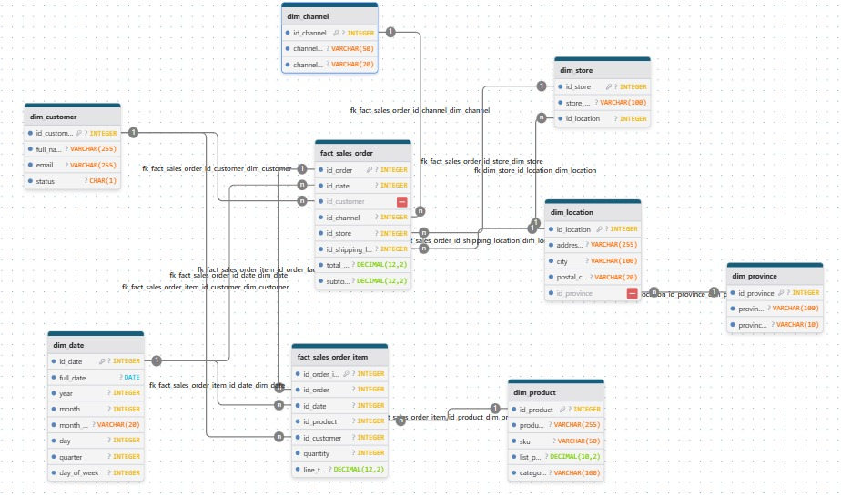
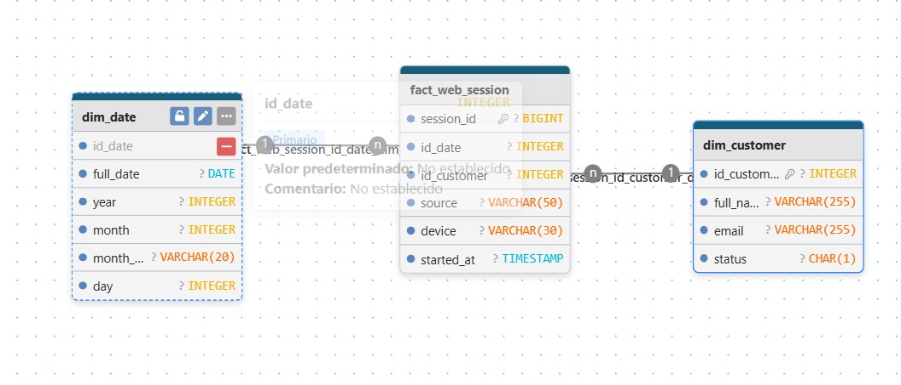
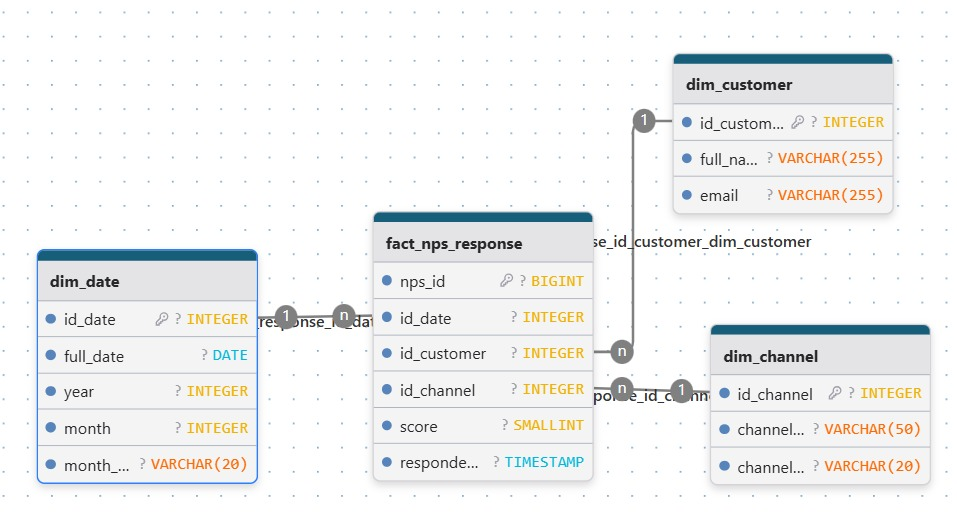
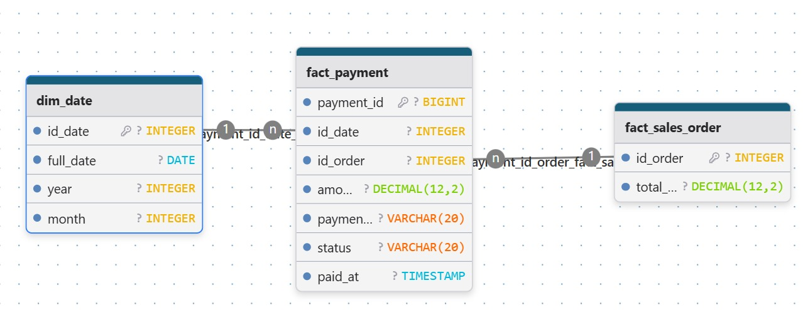
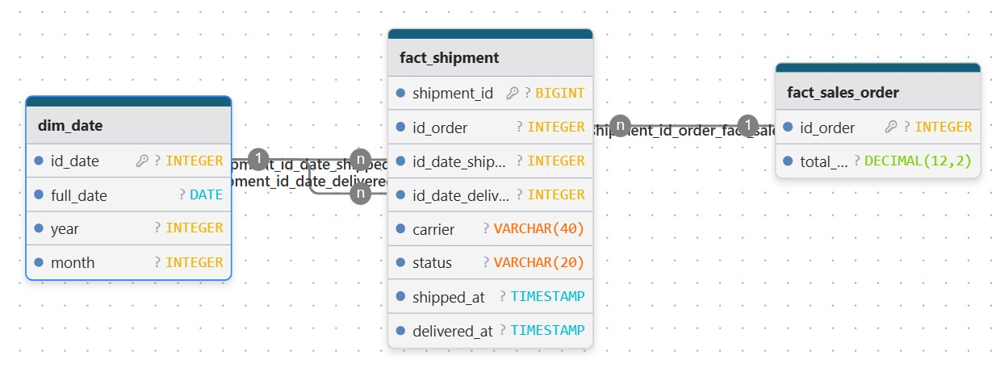

# Trabajo Práctico Final - Ecosistema de Datos (EcoBottle AR)

**Autor:** Gregorio Fernández Perrier

Proyecto final de "Introducción al Marketing Online y los Negocios Digitales". El objetivo es implementar un pipeline de ETL (Extract, Transform, Load) que toma datos crudos (`RAW/`), los modela en una Constelación de Hechos (Esquema Estrella) usando el script `transform.py`, y los carga en un Data Warehouse (carpeta `DW/`) listo para ser analizado.

---

## 0. Contenidos

1.  [Descripción y Objetivos](#1-descripción-y-objetivos)
2.  [Modelo de Datos y Supuestos](#2-modelo-de-datos-y-supuestos)
3.  [Diagramas del Esquema (Constelación de Hechos)](#3-diagramas-del-esquema-constelación-de-hechos)
4.  [Estructura del Repositorio](#4-estructura-del-repositorio)
5.  [Instrucciones de Ejecución](#5-instrucciones-de-ejecución)
6.  [Diccionario de Datos (Data Warehouse)](#6-diccionario-de-datos-data-warehouse)
7.  [KPIs del Dashboard (Próxima Entrega)](#7-kpis-del-dashboard-próxima-entrega)

---

## 1. Descripción y Objetivos

Este proyecto implementa un data warehouse (DW) liviano en formato CSV. El script de Python `transform.py` genera un modelo dimensional "Constelación de Hechos" siguiendo las mejores prácticas de Kimball.

[cite_start]El entregable final son las 13 tablas (`dim_` y `fact_`) en la carpeta `DW/`, listas para construir el dashboard de KPIs solicitado en **Looker Studio** [cite: 25][cite_start]: **Ventas**, **Usuarios Activos**, **Ticket Promedio**, **NPS**, **Ventas por Provincia** y **Ranking Mensual por Producto**[cite: 6].

---

## 2. Modelo de Datos y Supuestos

Se diseñó una **Constelación de Hechos** (múltiples esquemas estrella) donde las dimensiones comunes (ej. `dim_date`, `dim_customer`) son "conformadas" y compartidas por múltiples tablas de hechos.

**Supuestos y Decisiones de Modelado:**

* **Claves (Keys):**
    * Se utilizan las **Claves de Negocio (Business Keys)** originales (ej. `customer_id`, `product_id`) como claves primarias y foráneas en todo el modelo. Esto simplifica la trazabilidad con los datos `RAW` y cumple con los requisitos del proyecto sin generar *Surrogate Keys* (`_sk`).
* **Dimensión de Tiempo (`dim_date`):**
    * Esta es una **dimensión de conformación generada** por el script `transform.py`, ya que no existe en los datos `RAW`. Se crea en base al rango de fechas de la tabla `sales_order`.
    * Todas las tablas de hechos se vinculan a esta dimensión a través de un `id_date` numérico (formato `YYYYMMDD`).
* **Denormalización en Dimensiones:**
    * **`dim_product`**: Se denormaliza uniendo `product` con `product_category` para incluir el nombre de la categoría.
    * **`dim_location`**: Se denormaliza uniendo `address` con `province` para tener la información de provincia.
* **KPI de Ventas:**
    * [cite_start]Siguiendo la consigna, solo se consideran ventas válidas aquellas órdenes con estado `PAID` o `FULFILLED`[cite: 180].

---

## 3. Diagramas del Esquema (Constelación de Hechos)

Los siguientes diagramas (generados en `drawDB` y guardados en `esquemas_estrella/`) ilustran las relaciones entre las tablas de hechos y sus dimensiones.

### A. Constelación de Ventas (Pedidos, Items, Pagos y Envíos)


### B. Esquema de Sesiones Web (Usuarios Activos)


### C. Esquema de NPS


### D. Esquemas de Pagos y Envíos



---

## 4. Estructura del Repositorio

El proyecto utiliza una estructura simple con un script central de transformación.
.
├── README.md                # (Este archivo)
├── requirements.txt         # (Dependencias de Python)
├── .gitignore
├── transform.py             # (Script ETL principal que lee de RAW y escribe en DW)
│
├── RAW/                     # (Datos fuente - NO MODIFICAR)
│   └── *.csv
│
├── DW/                      # (Data Warehouse - DATOS GENERADOS)
│   ├── dim_*.csv
│   └── fact_*.csv
│
├── esquemas_estrella/       # (Diagramas del Modelo de Datos)
│   └── *.jpeg
│
└── .venv/                   # (Entorno virtual - Ignorado por Git)

## 5. Instrucciones de Ejecución

Para ejecutar este proyecto y (re)generar el Data Warehouse en tu máquina local:

1.  **Clonar el repositorio:**
    ```bash
    git clone [https://github.com/Gregoriofernandezperrier/mkt_tp_final_gregorio.git](https://github.com/Gregoriofernandezperrier/mkt_tp_final_gregorio.git)
    cd mkt_tp_final_gregorio
    ```

2.  **Crear y activar un entorno virtual:**
    ```bash
    # Crear el entorno
    python -m venv .venv

    # Activar en Windows (Command Prompt)
    .\.venv\Scripts\activate
    
    # Activar en macOS/Linux
    # source .venv/bin/activate
    ```

3.  **Instalar las dependencias:**
    ```bash
    pip install -r requirements.txt
    ```

4.  **Ejecutar el Pipeline ETL:**
    *Asegúrate de que la carpeta `RAW/` contenga todos los CSVs originales.*
    ```bash
    python transform.py
    ```

Tras la ejecución, la carpeta `DW/` (que se crea automáticamente) contendrá las 13 tablas del Esquema Estrella en formato `.csv`, listas para ser consumidas por Looker Studio.

## 6. Diccionario de Datos (Data Warehouse)

El pipeline genera las siguientes 13 tablas en la carpeta `DW/`.

### A. Dimensiones (Dims)

| Tabla | Descripción |
| :--- | :--- |
| **`dim_channel`** | Catálogo de canales de venta (Online, Offline). |
| **`dim_customer`** | Maestro de clientes (incluye `full_name`). |
| **`dim_date`** | Dimensión de calendario generada (Día, Mes, Año, etc.). |
| **`dim_location`** | Maestro de direcciones (une `address` y `province`). |
| **`dim_product`** | Maestro de productos (une `product` y `category`). |
| **`dim_province`** | Catálogo de provincias. |
| **`dim_store`** | Maestro de tiendas físicas y sus direcciones. |

### B. Hechos (Facts)

| Tabla | Descripción | Grano |
| :--- | :--- | :--- |
| **`fact_sales_order`** | Cabeceras de las órdenes de venta. | Una fila por orden. |
| **`fact_sales_order_item`** | Detalle de productos en cada orden. | Una fila por producto dentro de una orden. |
| **`fact_payment`** | Registra las transacciones de pago. | Una fila por transacción de pago. |
| **`fact_shipment`** | Registra la información logística de envíos. | Una fila por envío. |
| **`fact_web_session`** | Sesiones de navegación web. | Una fila por sesión web. |
| **`fact_nps_response`** | Respuestas a las encuestas de NPS. | Una fila por respuesta de encuesta. |

---

## 7. KPIs del Dashboard (Próxima Entrega)

[cite_start]Los archivos `.csv` generados en `DW/` son la fuente de datos para el dashboard en **Looker Studio**[cite: 25]. El modelo de datos permite calcular los siguientes KPIs:

* [cite_start]**Ventas Totales ($M)** [cite: 180]
* [cite_start]**Usuarios Activos (nK)** [cite: 182]
* [cite_start]**Ticket Promedio ($K)** [cite: 184]
* [cite_start]**NPS (ptos.)** [cite: 185]
* [cite_start]**Ventas por Provincia** [cite: 186]
* [cite_start]**Ranking Mensual por Producto** [cite: 187]